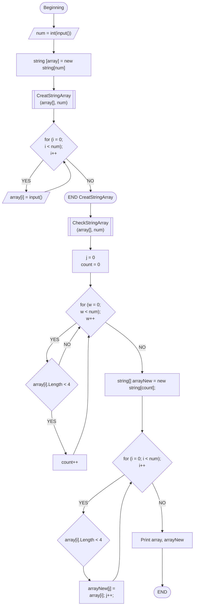

# ИТОГОВАЯ ЗАДАЧА
## **Задача**: Написать программу, которая из имеющегося массива строк формирует новый массив из строк, длина которых меньше, либо равна 3 символам. Первоначальный массив можно ввести с клавиатуры, либо задать на старте выполнения алгоритма. При решении не рекомендуется пользоваться коллекциями, лучше обойтись исключительно массивами.

## Примеры:
* ### [“Hello”, “2”, “world”, “:-)”] → [“2”, “:-)”]
* ### [“1234”, “1567”, “-2”, “computer science”] → [“-2”]
* ### [“Russia”, “Denmark”, “Kazan”] → []

